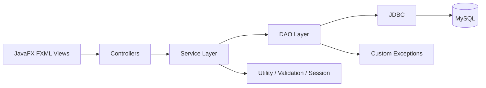

# System Architecture

Controllers never contain SQL. Services contain business rules such as event capacity and duplicate registration prevention. DAOs use prepared statements and try-with-resources.
