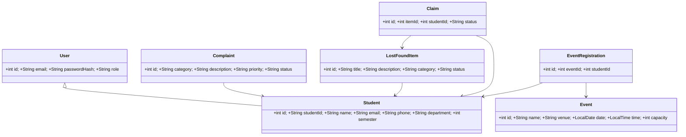

# Class Diagram

```mermaid
classDiagram
  class User { +int id; +String email; +String passwordHash; +String role }
  class Student { +int id; +String studentId; +String name; +String email; +String phone; +String department; +int semester }
  class Complaint { +int id; +String category; +String description; +String priority; +String status }
  class LostFoundItem { +int id; +String title; +String description; +String category; +String status }
  class Claim { +int id; +int itemId; +int studentId; +String status }
  class Event { +int id; +String name; +String venue; +LocalDate date; +LocalTime time; +int capacity }
  class EventRegistration { +int id; +int eventId; +int studentId }
  User <|-- Student
  Complaint --> Student
  LostFoundItem --> Student
  Claim --> LostFoundItem
  Claim --> Student
  EventRegistration --> Event
  EventRegistration --> Student
```
