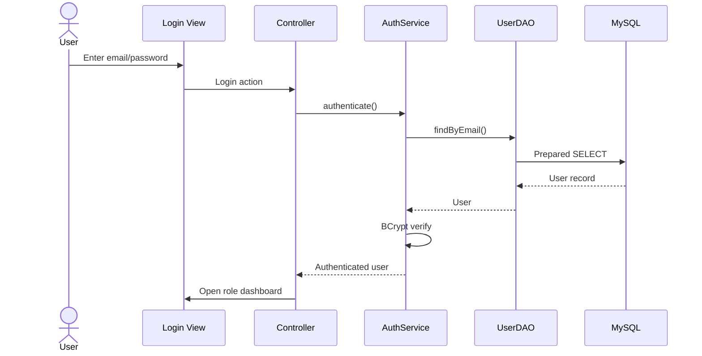

# Login Sequence Diagram

```mermaid
sequenceDiagram
  actor User
  participant View as Login View
  participant Controller
  participant Service as AuthService
  participant DAO as UserDAO
  participant DB as MySQL
  User->>View: Enter email/password
  View->>Controller: Login action
  Controller->>Service: authenticate()
  Service->>DAO: findByEmail()
  DAO->>DB: Prepared SELECT
  DB-->>DAO: User record
  DAO-->>Service: User
  Service->>Service: BCrypt verify
  Service-->>Controller: Authenticated user
  Controller->>View: Open role dashboard
```
