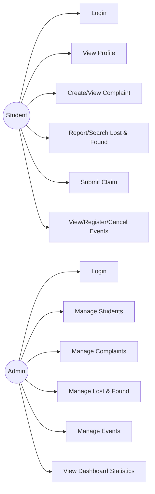

# Use Case Diagram

```mermaid
flowchart LR
  S((Student)) --> L[Login]
  S --> P[View Profile]
  S --> C[Create/View Complaint]
  S --> LF[Report/Search Lost & Found]
  S --> CL[Submit Claim]
  S --> E[View/Register/Cancel Events]
  A((Admin)) --> AL[Login]
  A --> SM[Manage Students]
  A --> CM[Manage Complaints]
  A --> LM[Manage Lost & Found]
  A --> EM[Manage Events]
  A --> AD[View Dashboard Statistics]
```
